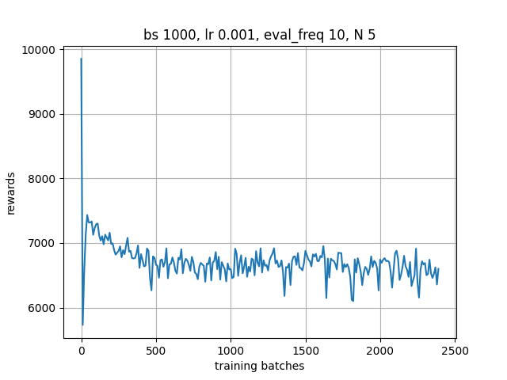

# Reward over Time Plots for td3_continuous from CleanRL
Eric Bae

# Preliminary Thoughts
the parts i will need
- reward over time plots
- different architectures and action modeling strategies
    - compare to generic log-prob minimization
- include a chart with method name, parameter used, and final reward

steps
- first i think im going to open the files and make sure i can process them
- i want to set up a pipeline that i can modify to try different architecutres and action models
    - for pipeline, just setup basic training on generic log-prob minimization
- then research into these different methods

# Preliminary Findings
Loaded up both pytorch files for data and actor weights
- dict_keys(['mean_reward', 'std_reward', 'observations', 'actions'])
- odict_keys(['action_scale', 'action_bias', 'fc1.weight', 'fc1.bias', 'fc2.weight', 'fc2.bias', 'fc_mean.weight', 'fc_mean.bias', 'fc_logstd.weight', 'fc_logstd.bias'])
- noticed 2400000 observations/actions pairs in data
- action_scale is the action space of half cheetah
- not really sure what action_bias is
- 256 fc1/fc2 weight and biases

<!--  -->

# Setting up pipeline
First, I wanted to create the training loop, evaluation function, and plotting function. I decided to start with baseline (-log prob minimization)

For the training loop:
- decided to start with mini-batch gradient descent 
    - not sure if full batch or stochastic would be better so just went with the mini batch
- decided 1000 per batch instead of 1024 to guarantee an even num of elements per split. might adjust this number later
- intuitively, my training loop code is very similar to my checkpoint code

First try:
- in my first initial run, I decided to define a few hyperparameters: `batch_size=1000`, `lr=1e-3`, `eval_freq=10`, and `N=5`
- `eval_freq` is how often I call the eval function in between iterations
- `N` defines how many episodes to run in the eval function
-  my main goal for this first run was to have a proof of concept working that I can work off on. Because of this, all hparams were somewhat arbitrary
- I decided to just try a Normal distribution with the log_prob to see what would happen

- with current hparams, there are 240 points on the graph and rewards are ~6500

# Different Methodologies Tried

- different hparam searching
    - learning rate: 1e-3, 1e-4 
    - batch sizes: 1000, 2000
    - N: 5, 10
    - I ran experiments trying different combinations of these hparams and found the best one was:
        - `lr=1e-4`, `batch_size=2000`, `N=10`
    - because of this, most of my hparams for the rest of the different models kept these hparams
- DAgger (Dataset Aggregation)
    - from what I read, this seems like a method to boost performance for models using obs-action pairs
    - it would be a modification of my training loop but it would keep my basic architecture intact so I kept it
    - "DAgger improves on behavioral cloning by training on a dataset that better resembles the observations the trained policy is likely to encounter, but it requires querying the expert online."  - [Source](https://imitation.readthedocs.io/en/latest/algorithms/dagger.html)
    - on the first try, I was getting about ~6500 by the final eval, worse than my baseline so I changed a couple things on the next try
        - shuffled the data in the dataset around so old and newly added data would be mixed
        - made it retrain for 3 epochs instead of just once every time train was called but it only increased to ~7000
        - still not as good as the baseline so decided to get back to the drawing board
- Gaussian Mixture k=5
    - my first attempt at it is getting around ~6500
        - to try to increase it, I decided to run another hparam grid search
            - batch_size = [500, 1000, 2000, 4000]
            - lr = [1e-3, 1e-4, 5e-4]
            - eval_freq = 10
            - N = 10
            - epochs = 1
        - the best hyperparameters I've found is batch_size=500 and lr=1e-3
        - even with hyperparameter training, I'm getting around baseline at most
    - in the next attempt, I widened the current linear layer up to 512 and added a 3rd Linear layer
        - also changed the loss calculation to just MSE
- Diffusion T=10
- Autoreggressive discretization B=20
- GAIL (Generative Adversarial Imitation Learning)
- AIRL (Adversarial Inverse RL)

## Chart of all methods

| Method | Hparams | Final Reward Return | Notes |
| :----: | :-----: | :-----------------: | :---: |
| Baseline log-prob min | batch_size=1000, lr=1e-3,   eval_freq=10, and N=5 | ~6500 | First baseline |
| Baseline log-prob min | batch_size=2000, lr=1e-4,   eval_freq=10, N=10 | ~7250 | Using Best Hparams |
| DAgger | batch_size=2000, lr=1e-4,   eval_freq=10, N=10 | ~7000 | Trying to   improve baseline |
| Gaussian Mixture | `k=5`, batch_size=500, lr=1e-3,   eval_freq=10, N=10 | ~6500 | k is number   of mixtures |
| MSE | batch_size=500, lr=1e-3,   eval_freq=10, N=30   epochs=3 weight_decay=1e-6 | ~9500 | This one is after   increasing the size   of the model and finding   optimal hparams |

# Best One Found
- With _____ I was able to get a reward of ~_____

