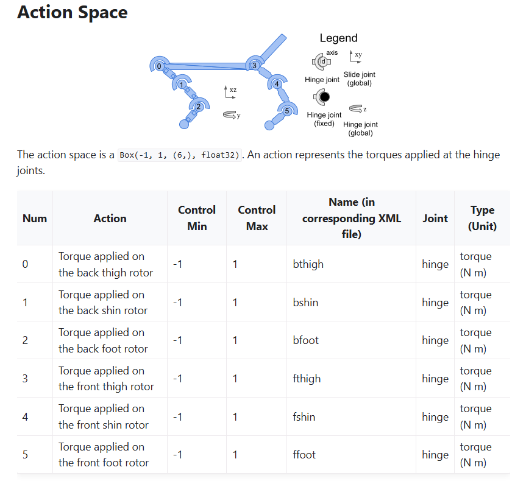

# Preliminary Thoughts
the parts i will need
- reward over time plots
- charts that I used
- different architectures and action modeling strategies
    - compare to generic log-prob minimization
- include a chart with method name, parameter used, and final reward

steps
- first i think im going to open the files and make sure i can process them
- i want to set up a pipeline that i can modify to try different architecutres and action models
    - for pipeline, just setup basic training on generic log-prob minimization
- then research into these different methods

# Preliminary Findings
Loaded up both pytorch files for data and actor weights
- dict_keys(['mean_reward', 'std_reward', 'observations', 'actions'])
- odict_keys(['action_scale', 'action_bias', 'fc1.weight', 'fc1.bias', 'fc2.weight', 'fc2.bias', 'fc_mean.weight', 'fc_mean.bias', 'fc_logstd.weight', 'fc_logstd.bias'])
- noticed 2400000 observations/actions pairs in data
- action_scale is the action space of half cheetah
- not really sure what action_bias is
- 256 fc1/fc2 weight and biases

# Setting up pipeline
First, I wanted to create the training loop, evaluation function, and plotting function. I decided to start with baseline (generic lob-prob minimization)

For the training loop:
- decided to start with mini-batch gradient descent 
    - not sure if full batch or stochastic would be better so just went with the mini batch
- decided 500 per batch instead of 512 to guarantee an even num of elements per split. might adjust this number later

